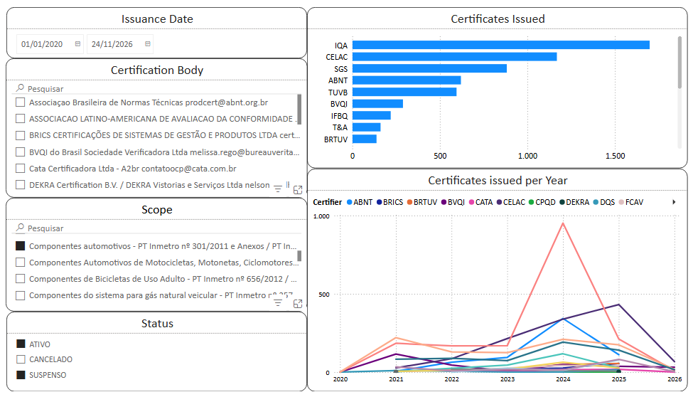

# Market Share OCPs (INMETRO)
# PT-BR

## Objetivo
Este projeto tem como objetivo analisar e visualizar o mercado de Organismos de Certificação de Produtos (OCPs) acreditados pelo INMETRO, permitindo uma compreensão mais clara do posicionamento de cada organismo em diferentes escopos ao longo do tempo.

## Fonte de Dados
Os dados utilizados neste projeto são provenientes do sistema Prodcert, disponibilizado pelo governo federal:
https://dados.gov.br/dados/conjuntos-dados/sistema-de-consulta-prodcert

## Metodologia
O projeto segue as seguintes etapas:
- Coleta dos dados públicos do Prodcert
- Limpeza, tratamento e transformação dos dados utilizando Python
- Construção de dashboards interativos no Power BI

## Ferramentas Utilizadas
- Python
- Power BI
- GitHub

## Visualização
O dashboard final pode ser acessado no link abaixo:

https://app.powerbi.com/view?r=eyJrIjoiMTkyZjY4ZmItNGU0NS00N2VkLTlmYTQtMGY0Y2VhMmY3OGU4IiwidCI6IjA4MGJjMDIzLTVlNWEtNDZmYi1iYmU4LWViNTQ4ZTk4NzNhNiJ9

Prévia do Dashboard:

## Insights Esperados
- Participação de mercado por OCP
- Evolução temporal por escopo
- Comparação entre organismos
- Identificação de tendências no setor

# ENG
## Objective
This project aims to analyze and visualize the market of Product Certification Bodies (OCPs) accredited by INMETRO, allowing a clearer understanding of the positioning of each organization in different scopes over time.

## Data Source
The data used in this project comes from the Prodcert system, provided by the federal government:
https://dados.gov.br/dados/conjuntos-dados/sistema-de-consulta-prodcert

## Methodology
The project follows the following steps:
- Collection of public data from Prodcert
- Cleaning, processing, and transforming the data using Python
- Building interactive dashboards in Power BI

## Tools Used
- Python
- Power BI
- GitHub

## Visualization
The final dashboard can be accessed at the link below:

https://app.powerbi.com/view?r=eyJrIjoiMTkyZjY4ZmItNGU0NS00N2VkLTlmYTQtMGY0Y2VhMmY3OGU4IiwidCI6IjA4MGJjMDIzLTVlNWEtNDZmYi1iYmU4LWViNTQ4ZTk4NzNhNiJ9

Quick view of the Dashboard:

## Expected Insights
- Market share by OCP
- Temporal evolution by scope
- Comparison between organizations
- Identification of trends in the sector
